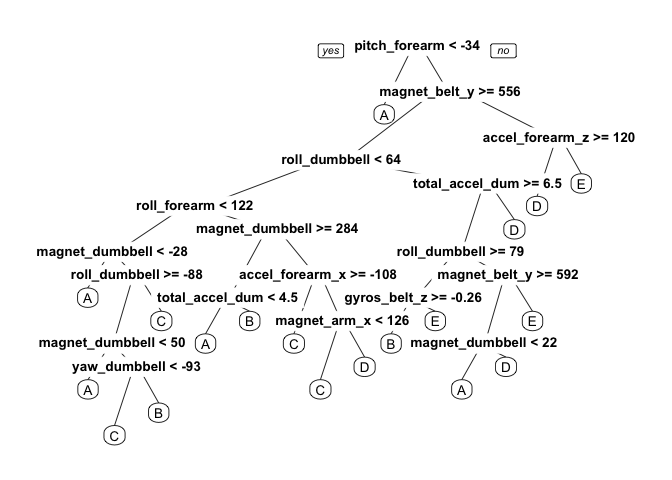

# Practical Machine Learning
Christian Lagares  
August 10, 2015  
# Hardware and Software
## R & R Studio    
### Main Software Version   

* R Studio Version 0.99.441   
* R version 3.2.0   

### Secondary Software Version  

* data.table Version 1.9.4   
* knitr Version 1.10.5     
* caret Version 6.0.52   
* foreach Version 1.4.2   
* rpart Version 4.1.10   
* rpart.plot Version 1.5.2
* corrplot Version 0.73

## Platform and Hardware    
### Platform and OS     

* Platform: x86_64-apple-darwin13.4.0 (64-bit)    
* OS: **Mac OS X *'El Capitan'*** (10.11 Public Beta 3)   

### Hardware     
* Macbook Pro 15" (Mid-2014)    
* Memory: 16 GB DDR3 1600MHz RAM     
* CPU: 2.8 GHz Intel Core i7 4th Generation (Codename: Haswell)  
     + Hyper-Threading is enabled; for information, access [Hyper Threading](http://www.cs.sfu.ca/~fedorova/Teaching/CMPT886/Spring2007/papers/hyper-threading.pdf)
     + Turbo-Boost 2.0 is enabled and was employed during the analysis, most specifically at the ***Read Data*** section of the analysis.

# Pre-Analysis Work
## Setup the Environment

I will define the user-defined function `load()` which is passed a character vector containing the names of the packages required in the analysis. We will also employ the simple, but robust function `load()` to bring into our analysis the following R Packages:
* data.table
* caret   
* foreach   
* rpart   
* rpart.plot   
* corrplot   
These packages have been previously installed using the `install.packages()` functions from the `utils` package installed in R Studio.


```r
load <- function(pkg) {
    new.pkg <- pkg[!(pkg %in% installed.packages()[, "Package"])]
    if (length(new.pkg)) 
        install.packages(new.pkg, dependencies = TRUE)
    sapply(pkg, require, character.only = TRUE)
}
packages <- c("data.table", "caret", "randomForest", "foreach", "rpart", "rpart.plot", 
    "corrplot")
load(packages)
```

```
## Loading required package: data.table
## Loading required package: caret
## Loading required package: lattice
## Loading required package: ggplot2
## Loading required package: randomForest
## randomForest 4.6-10
## Type rfNews() to see new features/changes/bug fixes.
## Loading required package: foreach
## Loading required package: rpart
## Loading required package: rpart.plot
## Loading required package: corrplot
```

```
##   data.table        caret randomForest      foreach        rpart 
##         TRUE         TRUE         TRUE         TRUE         TRUE 
##   rpart.plot     corrplot 
##         TRUE         TRUE
```
# Analysis Work
## Read Data
We have previously deposited the files `pml-training.csv` and `pml-testing.csv` into the current working directories. The original files can be downloaded from [Human Activity Recognition](http://groupware.les.inf.puc-rio.br/har)

Acknowledgement:  

> Velloso, E.; Bulling, A.; Gellersen, H.; Ugulino, W.; Fuks, H. *Qualitative Activity Recognition of Weight Lifting Exercises*. Proceedings of 4th International Conference in Cooperation with SIGCHI (Augmented Human '13) . Stuttgart, Germany: ACM SIGCHI, 2013.    

Steps:
1. Read training set
2. Read testing set 

```r
if (!exists("training_data")) {
    training_data <<- read.csv("pml-training.csv", na.strings = c("#DIV/0!", 
        " ", "", "NA", "NAs", "NULL"))
} else {
    training_data <<- training_data
}
if (!exists("testing_data")) {
    testing_data <<- read.csv("pml-testing.csv", na.strings = c("#DIV/0!", " ", 
        "", "NA", "NAs", "NULL"))
} else {
    testing_data <<- testing_data
}
```

## Clean the data
* I need to drop columns with NAs, drop highly correlated variables and drop variables with 0 (or approx to 0) variance.
* The results are hidden as they take a very long space.

Any variance equal to zero or near to zero was removed.

In the [*Introduction to Psychometric Theory*](https://books.google.com/books?id=3vItCgAAQBAJ&dq=psychometric+theory+correlation+.7&hl=es&source=gbs_navlinks_s&redir_esc=y) ***.7+*** correlation is considered, a high correlation, and will be considered a threshold in this analysis. Variables out of compliance with this threshold will be removed.

> Raykov, Tenko, and George A Marcoulides. *Introduction To Psychometric Theory*. New York: Routledge, 2011. Print.

Some columns were blank, hence are dropped. I will use a set that only includes complete columns. I also remove user name, timestamps and windows to have a light data set.

```r
str(training_data)
cleantraining <- training_data[, -which(names(training_data) %in% c("X", "user_name", 
    "raw_timestamp_part_1", "raw_timestamp_part_2", "cvtd_timestamp", "new_window", 
    "num_window"))]
cleantraining = cleantraining[, colSums(is.na(cleantraining)) == 0]  #this drops columns with NAs
zerovariance = nearZeroVar(cleantraining[sapply(cleantraining, is.numeric)], 
    saveMetrics = TRUE)
cleantraining = cleantraining[, zerovariance[, "nzv"] == 0]  #to remove 0 or near to 0 variance variables
correlationmatrix <- cor(na.omit(cleantraining[sapply(cleantraining, is.numeric)]))
dim(correlationmatrix)
correlationmatrixdegreesoffreedom <- expand.grid(row = 1:52, col = 1:52)
correlationmatrixdegreesoffreedom$correlation <- as.vector(correlationmatrix)  #this returns the correlation matrix in matrix format
removehighcorrelation <- findCorrelation(correlationmatrix, cutoff = 0.7, verbose = TRUE)
cleantraining <- cleantraining[, -removehighcorrelation]  #this removes highly correlated variables

for (i in c(8:ncol(cleantraining) - 1)) {
    cleantraining[, i] = as.numeric(as.character(cleantraining[, i]))
}

for (i in c(8:ncol(testing_data) - 1)) {
    testing_data[, i] = as.numeric(as.character(testing_data[, i]))
}

featureset <- colnames(cleantraining[colSums(is.na(cleantraining)) == 0])[-(1:7)]
modeldata <- cleantraining[featureset]
featureset
```

## Model
The sample previously obtained is splitted into two sets. **60%** of the sample has been reserved for training and **40%** for testing, which has been considered a responsible and reproducible standard.


```r
idx <- createDataPartition(modeldata$classe, p = 0.6, list = FALSE)
training <- modeldata[idx, ]
testing <- modeldata[-idx, ]
```

A predictive model is fitted using the Random Forest algorithm. Highly correlated variables have already been removed, but this algorithm is considered to be more robust when employed to correlated covariates and outliers. 
Cross Validation: The *5-Fold* Cross Validation method is employed; 


```r
control <- trainControl(method = "cv", 5)
model <- train(classe ~ ., data = training, method = "rf", trControl = control, 
    ntree = 250)
model
```

```
## Random Forest 
## 
## 11776 samples
##    23 predictor
##     5 classes: 'A', 'B', 'C', 'D', 'E' 
## 
## No pre-processing
## Resampling: Cross-Validated (5 fold) 
## Summary of sample sizes: 9420, 9421, 9421, 9421, 9421 
## Resampling results across tuning parameters:
## 
##   mtry  Accuracy   Kappa      Accuracy SD  Kappa SD   
##    2    0.9697685  0.9617394  0.007420337  0.009393152
##   12    0.9671358  0.9584102  0.005968091  0.007554655
##   23    0.9590684  0.9482130  0.007692256  0.009723087
## 
## Accuracy was used to select the optimal model using  the largest value.
## The final value used for the model was mtry = 2.
```
The performance of the model is *estimated* on the validation data set.


```r
predict <- predict(model, testing)
confusionMatrix(testing$classe, predict)
```

```
## Confusion Matrix and Statistics
## 
##           Reference
## Prediction    A    B    C    D    E
##          A 2226    5    0    1    0
##          B   33 1472   10    0    3
##          C    0   22 1335   11    0
##          D    1    0   47 1228   10
##          E    4    8    3   21 1406
## 
## Overall Statistics
##                                           
##                Accuracy : 0.9772          
##                  95% CI : (0.9736, 0.9804)
##     No Information Rate : 0.2886          
##     P-Value [Acc > NIR] : < 2.2e-16       
##                                           
##                   Kappa : 0.9711          
##  Mcnemar's Test P-Value : NA              
## 
## Statistics by Class:
## 
##                      Class: A Class: B Class: C Class: D Class: E
## Sensitivity            0.9832   0.9768   0.9570   0.9738   0.9908
## Specificity            0.9989   0.9927   0.9949   0.9912   0.9944
## Pos Pred Value         0.9973   0.9697   0.9759   0.9549   0.9750
## Neg Pred Value         0.9932   0.9945   0.9907   0.9950   0.9980
## Prevalence             0.2886   0.1921   0.1778   0.1607   0.1809
## Detection Rate         0.2837   0.1876   0.1702   0.1565   0.1792
## Detection Prevalence   0.2845   0.1935   0.1744   0.1639   0.1838
## Balanced Accuracy      0.9911   0.9848   0.9759   0.9825   0.9926
```

```r
accuracy <- postResample(predict, testing$classe)
accuracy
```

```
##  Accuracy     Kappa 
## 0.9771858 0.9711275
```
The estimated accuracy of the model is **97.6%** and the estimated out of sample error is **2.4%**.

## Predictions
The model is aplied to the original testing data.


```r
result <- predict(model, training[, -length(names(training))])
result
```

## Tree
The result of the analysis will be displayed to illustrate the prediction tree employed.


```r
treeModel <- rpart(classe ~ ., data = cleantraining, method = "class")
prp(treeModel)
```

 

# Post-Analysis Work
## ANSWERS
The Coursera Project Submission requires `.txt` files to test the model and validate the submission.


```r
pml_write_files = function(x) {
    n = length(x)
    for (i in 1:n) {
        filename = paste0("problem_id_", i, ".txt")
        write.table(x[i], file = filename, quote = FALSE, row.names = FALSE, 
            col.names = FALSE)
    }
}

testing_data <- testing_data[featureset[featureset != "classe"]]
answers <- predict(model, newdata = testing_data)
answers
```

```
##  [1] B A B A A E D B A A B C B A E E A B B B
## Levels: A B C D E
```

```r
pml_write_files(answers)
```
